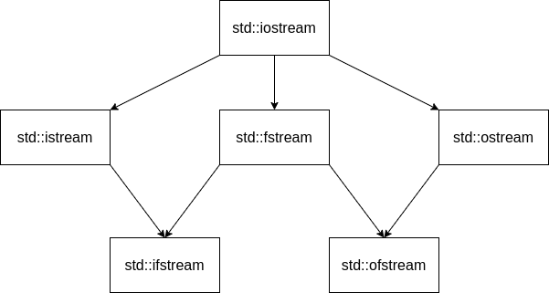

# Седмица 13 - Текстови файлове

## Потоци
Много често ни се налага да имаме няколко програми, които си взаимодействат - част от тях генерират някакви данни, а друга част от тях използват генерираните данни, за да направят някакви изчисления (те също може да са генератори за други програми). В такива случаи искаме, когато програмите-генератори приключат своята работа, резултата от нея да се запази, за да може някоя друга програма да го използва. От друга страна пък искаме, когато някоя програма вземе част от генерираните данни, тя да не може да се вземе от друга програма. Потоците са механизъм, който ни позволява точно това. За потоците може да си мислим като за буфери, в които слагаме и взимаме някакви данни, като най-често тези буфери представляват структура от данни от типа "първият влязъл - първият излязъл" (FIFO), въпреки че в някои случаи това може да не е изцяло вярно. Пример за потоци, които използваме постоянно са стандартния вход и стандартния изход - потребителя записва данни на стандартния вход, посредством клавиатурата, а програмата чете данни от него чрез `std::cin`. При стандартния изход е наобратно - програмата записва данни в него чрез `std::cout`, а потребителя ги "консумира" като терминала ги разпечатва за него. 

## Файлове и сравнение с масиви
Файлът е блок от данни, записан на някакъв траен носител. В някакъв смисъл блокът от данни прилича доста на масив - данните в него са разположени последователно (изключваме факта, че файловете може да са фрагментирани) и може да се индексира. Данните във файла, за разлика от тези в масива обаче, са персистентни - не се изтриват след приключване на програмата или изключване на машината, на която са записани. Също така данните във файловете могат да са доста големи и достъпа до тях е много бавен, понеже се съхраняват на диска.

## Файловете като потоци
Свойствата на файловете, разгледани по-горе, ни позволяват да разглеждаме файловете като потоци. В тях можем да записваме и да четем данни последователно, като записаните данни се запазват след преключването на програмата, която ги е записала. Това, което не е вярно е, че файлът не представлява структура от типа "първият влязъл - първият излязъл", но това не е проблем за нашата интерпретация на поток. Също така файлът има няколко свойства повече спрямо потока - саморазширява се при записването на данни в него и могат да се достъпват елементи на произволни позиции в него.

## Йерархия на потоците в C++
В C++ има много начини за създаване на потоци, като някои от тях са просто по-конкретни версии на някои други. На долната графика са представени всички важни за нас потоци за работа с файлове. Стрелките между отделните потоци показват кой поток кой наследява, т.е. с кой поток има общи характеристики, но е по-конкретен. Също така имаме взаимно заменяемост - ако един поток `X` наследява поток `Y`, то навсякъде в програмата, където очакваме поток `Y`, може да използваме поток `X`.



## Работа с текстови файлове
В рамките на този курс ще се занимаваме само с текстови файлове. При тях имаме форматиран вход и изход, т.е. можем да записваме данните в някакъв формат, който може да се прочете от човек - цифри, букви, специални знаци и др. Това означава, че можем да интерпретираме данните във файла като текст. Но стандартния вход и стандартния изход имат същите свойства - това означава, че работата с текстови файлове ще е почти същата като тази със стандартния вход и изход. Но преди да започнем да записваме или четем данни от файл, трябва да го отворим за четене или писани или и двете. Да разгледаме различните начини за отваряне на файл:
```c++
std::fstream file("file.txt");
std::fstream file("file.txt", std::ios::in);
std::fstream file("file.txt", std::ios::out);
std::ofstream file("file.txt");
std::ifstream file("file.txt");

std::fstream file;
file.open("file.txt");
```

- първият отваря файл едновременно за четене и писане;
- вторият отваря файл само за четене;
- третият отваря файл само за писане;
- четвъртият е по-кратък запис за втория;
- петият е по-кратък запис за третия;
- шестият е аналогичен на първия, но при него създаването на потока и отварянето на файла е на две стъпки.

Аргумента, който подаваме при отваряне на файл е пътят до този файл, като той може да бъде абсолютен или релативен. Нещо, което не трябва да забравяме при работа с файлове е да ги затворим след като сме спрели да ги ползваме. Това става като извикаме функцията `close()` на файловия поток, който сме създали. Ако не затворим файл може да настъпят много проблеми - от невъзможност на други програми да отварят файла до борба за ресурсите на файла.

Сега вече като сме отворили файла, можем да работим с него по абсолютно същия начин като със `std::cin` и `std::cout` - ако искаме да запишем данни във файла използваме операторът `<<`, а ако искаме да прочетем - `>>`. Пример за записване и четене на числа във и от файл:
```c++
std::fstream file("numbers.txt");

int n;
file >> n;
n *= 10;
file << n;

file.close();
```

В този пример прочитаме едно цяло число от файла, умножаваме го по 10 и го записваме обратно във файла. Записването става на позицията след тази, от която сме прочели първоначално числото, като ако е имало някакви данни там, те се презаписват.

## Указатели във файловете
По-горе стана въпрос, че може да достъпваме елементи на произволни позиции във файл. Това е възможно понеже вътрешно във всеки файл има два указателя - единият следи до коя позиция сме стигнали с четенето от него и до коя позиция - с писането. Ако файлът е отворен и за писане, и за четене, то двата указателя стоят на една и съща позиция. Имаме възможността и да ги отместваме ръчно - именно така можем да достъпваме елементи на произволни позиции и един вид да индексираме елементите. За тази цел имаме следните функции към файловите потоци:
- `tellg` - връща позицията на указателя за четене;
- `tellp` - връща позицията на указателя за писане;
- `seekg` - мести указателя за четене на подадената позици;
- `seekp` - мести указателя за писане на подадената позиция;

## Задача 01 - Четене на файл
Напишете функция, която по подадено име на файл, изкарва на стандартния изход цялото съдържание на файла.

## Задача 02 - Размер на файл
Напишете функция, която по подадено има на файл, връща размера на файла.

### Пример:
Съдържание на файла:

`I am going to become the best programmer`

Изход: 40

## Задача 03 - Думи във файл
Напишете функция, която по подадено име на файл, чете от файла всички думи и добавя в края му всички думи с дължина по-малка от 6, като в края на всяка дума се добавя толкова символи `@`, че дължината да стане точно 6.

### Пример:
Съдържание на файла:

`It is exciting to be a programmer`

Изход:

`It is exciting to be a programmer It@@@@ is@@@@ to@@@@ be@@@@ a@@@@@`

## Задача 04 - Плод и зеленчук
Вие сте собственик на магазин за плодове и зеленчуци и искате да автоматизирате работата си и затова решавате да напишете програма, която следи наличния инвентар и печалбите накрая на деня. Всеки продукт, който продавате си има име, количество и цена. Във файл `inventory.txt` се съдържат число N - броят на продуктите в инвентара ви, а на следващите N реда - продуктите с техните характеристики. След това от стандартния изход ще получите число M и М реда във формат `{име} {количество}`, които представляват заявка за копуване на продукт с конкретно име и количество. Ако нямате достатъчно продукти да се изведе съобщение: "Not enough {име}". Ако има трябва да обновите количеството в инвентара ви. Накрая да се изведе общата печалба от всички продажби.

### Пример:
```
Съдържание на inventory.txt:                       Изход:
5                                                  Not enough Tomato
Orange 10 2.34                                     Not enough Orange
Lemon 50 1.23                                      80.58
Carrot 20 3.42
Apple 30 1.50
Tomato 0 3.00
6
Orange 8
Carrot 5
Apple 20
Tomato 6
Orange 5
Lemon 12
```